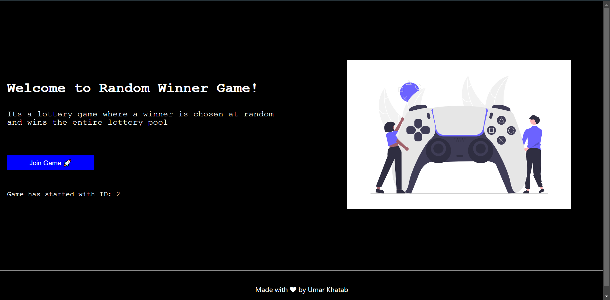

# Random-Winner-Game

    A simple 'n' player lottery game based upon True Randomness.
    
### Usage

Here's how the flow Take place

    - A user comes to the site
    - Login Via Metamask
    - Join the game
    - When Max Number of Players Joined the game
    - Random Winner is Selected 
    - Winner will get maxplayers*entryfee amount of ether
    

###  Concepts Involved
  
    - ChainLink VRFs
    
    - Polygon
    
    - NextJs
            Api Routing
            CSS Modules
            Use Hooks
            State management
            Conditional Rendering
            Async functions
            Timed Functions
      
    - Ethers.js
            Provider
            Signer
            Utils
            call transactions
      
    - Web3Modal
            Metamask Connection
            Web3Modal Provider

    - Solidity    
            OpenZeppelin
            ERC721 Emuerable 
            Ownable
            Custom Smart contracts 
            Receiving Ether
            Mapping
            Payable Function
            Pure Function
            View Functions
    

#### Deployment Network

    Polygon Mumbai testnet

#### Deployment Link    
    
